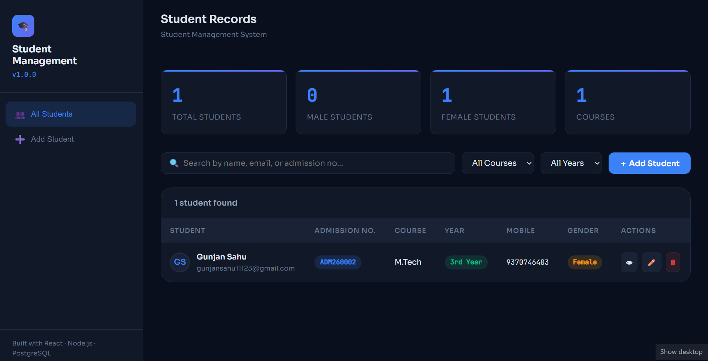
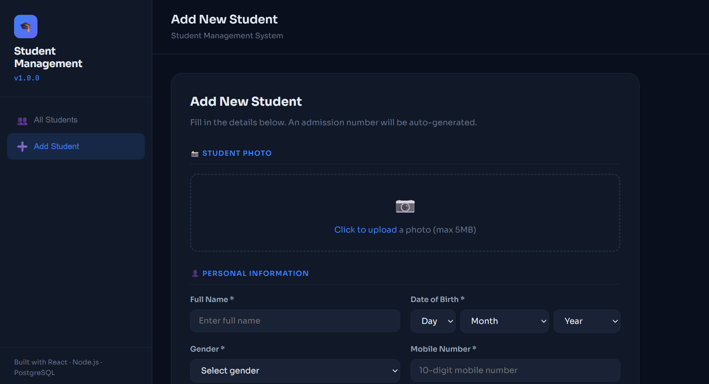

# 🎓 Student Management System

A full-stack Student Management System built with **React**, **Node.js (Express)**, and **PostgreSQL**.

> Submitted as part of the Pillai University Software Development Internship Technical Assessment.

## 🔗 Links

| | |
|---|---|
| 🌐 Live Website (https://student-management-system-seven-kappa.vercel.app/) 
| 💻 GitHub Repo (https://gunjan-111.github.io/Student-Management-System-/) 

---

## 📸 Screenshots
  ## Dashboard



## Student


> 

---

## 🛠 Technologies Used

| Layer | Technology |
|---|---|
| Frontend | React 18, React Router v6, Axios |
| Backend | Node.js, Express.js |
| Database | PostgreSQL |
| Validation | express-validator (backend), custom validation (frontend) |
| File Upload | Multer |
| Styling | Custom CSS |

---

## ✅ Features

- Add student with photo upload
- Edit / Update student details
- View all students in paginated table
- Delete student with confirmation
- Full student profile view
- Auto-generated unique Admission Number (`ADM250001`)
- Search by name, email, or admission number
- Filter by course and year
- Form validation on both frontend and backend
- Responsive UI
- Environment variable based configuration

---

## 📁 Project Structure

```
student-management/
├── backend/
│   ├── middleware/
│   │   └── upload.js         # Multer config for photo uploads
│   ├── routes/
│   │   └── students.js       # All REST API routes
│   ├── uploads/              # Uploaded photos (git-ignored)
│   ├── db.js                 # PostgreSQL connection + auto table creation
│   ├── server.js             # Express entry point
│   ├── .env.example
│   └── package.json
│
└── frontend/
    ├── public/
    │   └── index.html
    ├── src/
    │   ├── components/
    │   │   └── StudentForm.js    # Reusable form component
    │   ├── pages/
    │   │   ├── StudentList.js    # List with search & filter
    │   │   ├── AddStudent.js     # Add new student
    │   │   ├── EditStudent.js    # Edit existing student
    │   │   └── StudentDetail.js  # Student profile view
    │   ├── utils/
    │   │   └── api.js            # Axios API calls
    │   ├── App.js
    │   ├── index.js
    │   └── index.css
    ├── .env
    └── package.json
```

---

## ⚙️ Setup Instructions

### Prerequisites
- Node.js v18+
- PostgreSQL 14+
- Git

### 1. Clone the Repository

```bash
git clone https://github.com/gunjan-111/Student-Management-System-.git
cd student-management-system
```

### 2. Database Setup

Open PostgreSQL and run:

```sql
CREATE DATABASE student_management;
```

> Tables are auto-created when the backend starts — no manual SQL needed.

### 3. Backend Setup

```bash
cd backend
npm install
```

Create your `.env` file:

```env
PORT=5000
DB_HOST=localhost
DB_PORT=5432
DB_NAME=student_management
DB_USER=postgres
DB_PASSWORD=your_password
FRONTEND_URL=http://localhost:3000
```

Start the server:

```bash
npm run dev
```

Backend runs at `http://localhost:5000`

### 4. Frontend Setup

```bash
cd frontend
npm install
```

Create your `.env` file:

```env
REACT_APP_API_URL=http://localhost:5000
```

Start the app:

```bash
npm start
```

Frontend runs at `http://localhost:3000`

---

## 🔌 API Endpoints

| Method | Endpoint | Description |
|---|---|---|
| GET | `/students` | Fetch all students (supports `?search=`, `?course=`, `?year=`, `?page=`, `?limit=`) |
| GET | `/students/:id` | Fetch single student |
| POST | `/students` | Add new student (multipart/form-data) |
| PUT | `/students/:id` | Update student |
| DELETE | `/students/:id` | Delete student |
| GET | `/health` | Health check |

### POST /students — Form Fields

| Field | Type | Required | Notes |
|---|---|---|---|
| name | string | ✅ | Max 100 chars |
| course | string | ✅ | |
| year | number | ✅ | 1–6 |
| date_of_birth | date | ✅ | YYYY-MM-DD |
| email | string | ✅ | Must be unique |
| mobile | string | ✅ | 10-digit Indian mobile |
| gender | string | ✅ | Male / Female / Other |
| address | string | ✅ | |
| photo | file | ❌ | jpg/png/gif/webp, max 5MB |

---

## 🗃 Database Schema

```sql
CREATE TABLE students (
  id               SERIAL PRIMARY KEY,
  admission_number VARCHAR(20)  UNIQUE NOT NULL,
  name             VARCHAR(100) NOT NULL,
  course           VARCHAR(100) NOT NULL,
  year             INTEGER      NOT NULL CHECK (year BETWEEN 1 AND 6),
  date_of_birth    DATE         NOT NULL,
  email            VARCHAR(150) UNIQUE NOT NULL,
  mobile           VARCHAR(15)  NOT NULL,
  gender           VARCHAR(10)  NOT NULL CHECK (gender IN ('Male', 'Female', 'Other')),
  address          TEXT         NOT NULL,
  photo_path       VARCHAR(255),
  created_at       TIMESTAMP    DEFAULT NOW(),
  updated_at       TIMESTAMP    DEFAULT NOW()
);
```

**Admission Number format:** `ADM{YY}{NNNN}` — e.g. `ADM250001`, `ADM250002`

---

## 👨‍💻 Author

**Gunjan Sahu**
B.Tech Computer Engineering — Pillai College of Engineering (2024–2028)

